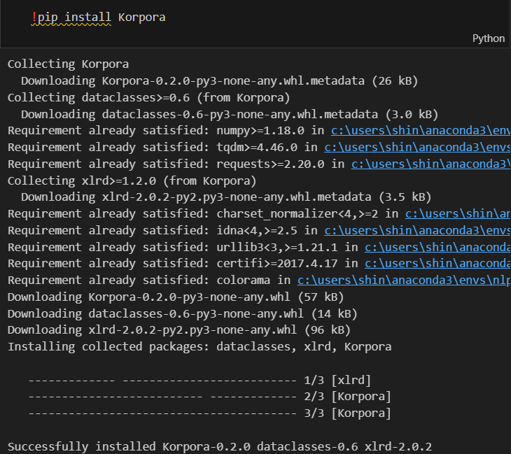
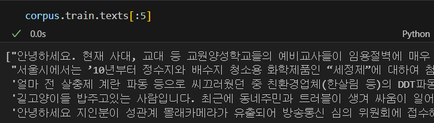
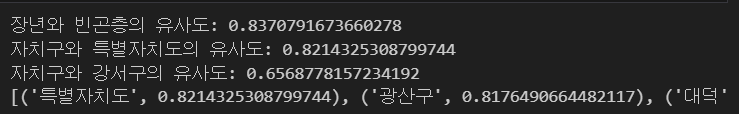

# 유사한 단어 찾기

## 사용한 데이터셋

 
Korpora는 품질 좋은 말뭉치를 저장해놓은 오픈소스 파이썬 패키지이다. pip로 간단하게 설치 가능하고 코드 한 줄로 데이터를 다운받고, 로딩할 수 있다.

 

내가 사용한 데이터는 Korpora에 올라와있는 데이터 중 청와대 국민청원 데이터를 사용했다.

 

전처리는 한국 불용어 모음에서 불러와서 '은', '는' 과 같은 조사들을 추가했고, Okt로 텍스트에서 명사만 추출해 진행했다. 한국어가 아닌 다른 언어들은 전부 제거했다.

모델로는 FastText 모델을 썼는데, 추측 단어 입력시 단어 사전에 없는 단어를 입력해도 그대로 진행되는게 좋을 것 같았고, subword로 찾는게 더 효과적일 것이란 생각이 들었다.

 

 

